# Crear un proyecto de react

Siguiendo las instrucciones de [Create React App](https://github.com/facebook/create-react-app).
`npm install -g create-react-app`
`create-react-app practicaserie`
`cd practicaserie`

## Paquetes usados:
### React-vis
`npm install react-vis`

### Material-UI
`npm install @material-ui/core`
`npm install fontsource-roboto`

Ahora sustutuir el archivo App.js de la carpeta src en su proyecto.

Para correr el proyecto usar en el directorio del proyecto:
### `npm run start`

Abrir [http://localhost:3000](http://localhost:3000) para visualizar en el navegador.

### Vistas del programa
La práctica consta de un gráfico que muestra la representación de la serie de Fourier seleccionada en la lista de opciones.
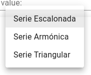

 Se puede modificar el valor de N con el slidebar color morado de la parte de abajo el cual puede tomar valores entre 1-650
 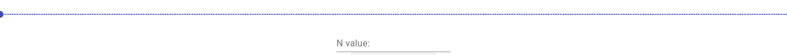
 Si el valor deseado es más grande que 650 se puede poner en el cuadro de texto "N Value:"
 
 Las gráficas definidas en el programa son:
 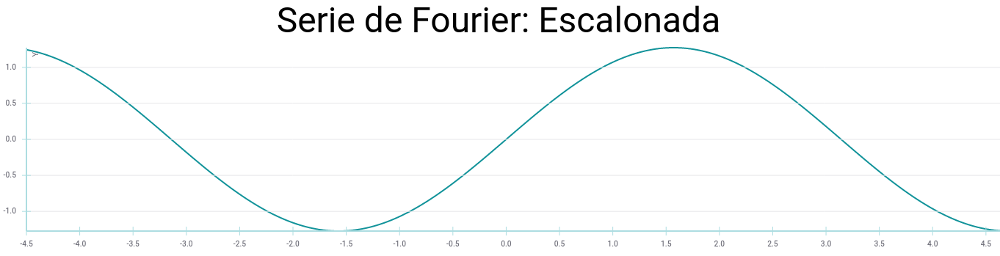
 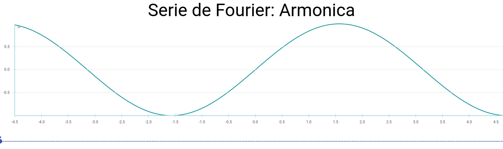
 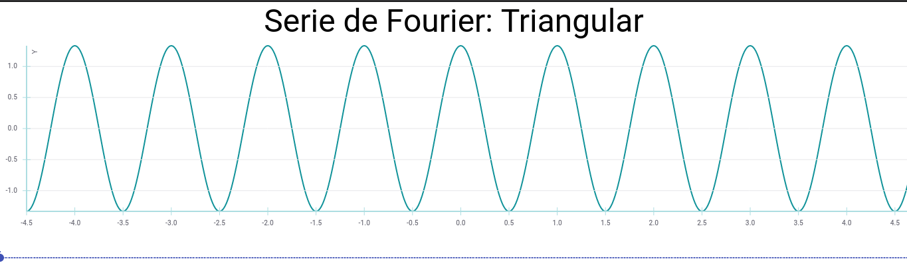
 
 
 Cuyas aproximaciones en un graficador son:
 
 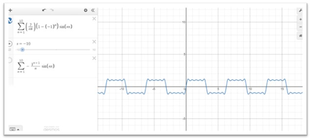
 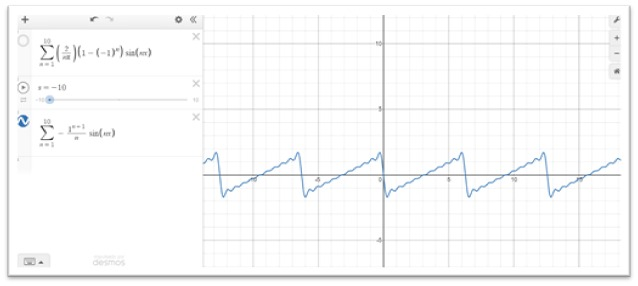
 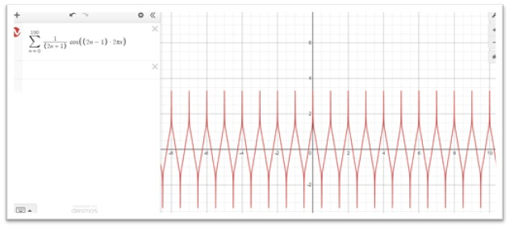
 
Si por ejemplo deslizamos el valor a 10 con la función escalonada seleccionada se mostraria lo siguiente:
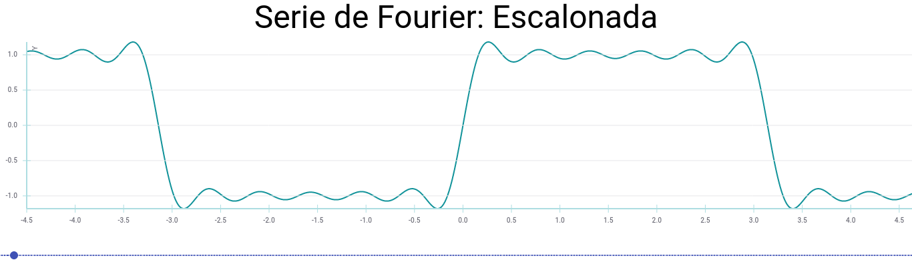
Con un valor de 90 el resultado sería:
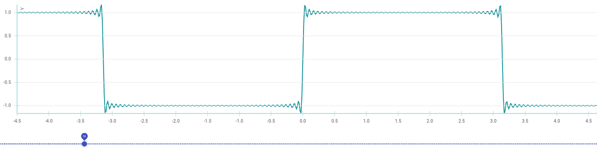
Y finalmete con un valor de 600 la gráfica sería:
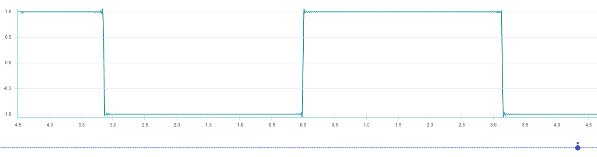

Para la función triangular con un valor de n igual a 260 se mostraría:
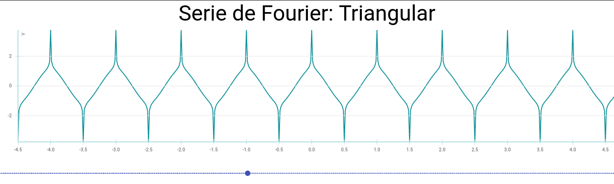

Para la función armónica con un valor de n igual a 190 se mostraría:
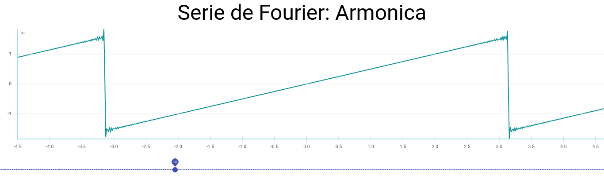
